# SameDaySuits Pattern Factory - System Architecture

**Version:** 1.0  
**Date:** 2026-02-01  
**Status:** Production  

---

## Table of Contents

1. [System Overview](#1-system-overview)
2. [Order Processing Flow](#2-order-processing-flow)
3. [Nesting Algorithm Selection](#3-nesting-algorithm-selection)
4. [Cutter Queue Flow](#4-cutter-queue-flow)
5. [Recovery & Resilience](#5-recovery--resilience)
6. [File Output Structure](#6-file-output-structure)
7. [API Request Flow](#7-api-request-flow)
8. [Deployment Architecture](#8-deployment-architecture)
9. [BlackBox Scanning Pipeline](#9-blackbox-scanning-pipeline)
10. [Component Reference](#10-component-reference)

---

## 1. System Overview

The SameDaySuits Pattern Factory is an automated garment manufacturing system that transforms customer measurements into cutter-ready PLT files for a Jindex UPC inkjet cutter.

### High-Level Architecture

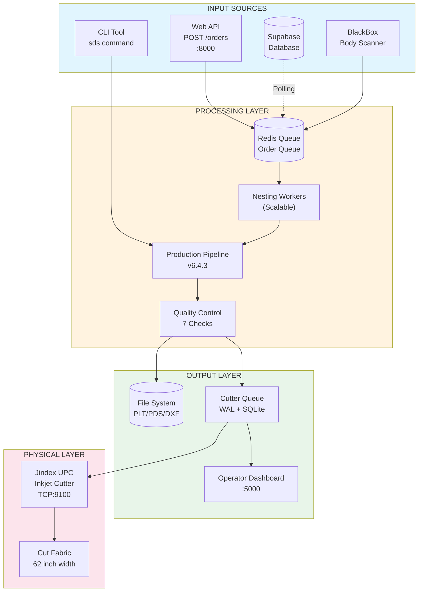

### Component Summary

| Component | Technology | Purpose |
|-----------|------------|---------|
| Web API | FastAPI | REST endpoints for order submission |
| CLI | Python argparse | Command-line order processing |
| Redis Queue | Redis | Async order queue with priority |
| Nesting Workers | Python multiprocessing | Scalable order processors |
| Production Pipeline | Python | PDS → PLT conversion |
| Quality Control | Python | Automated validation (7 checks) |
| Cutter Queue | SQLite + WAL | Crash-safe job queue |
| Operator Dashboard | Flask | Web UI for cutter operators |
| Jindex Cutter | TCP Socket | Physical fabric cutter |

---

## 2. Order Processing Flow

Complete flow from order input to cut fabric.

### Processing Pipeline

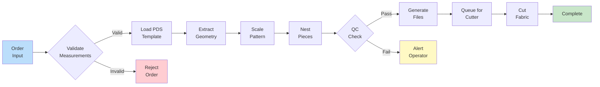

### Processing Stages Detail

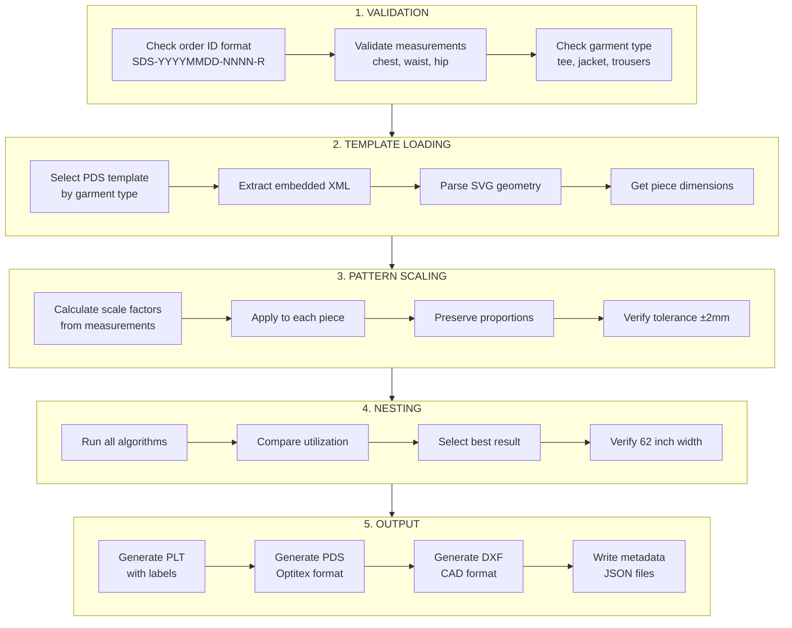

### Order Status States

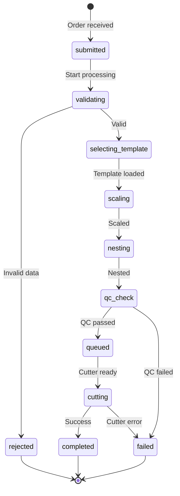

---

## 3. Nesting Algorithm Selection

The `master_nest()` function runs all algorithms and selects the best result.

### Algorithm Competition

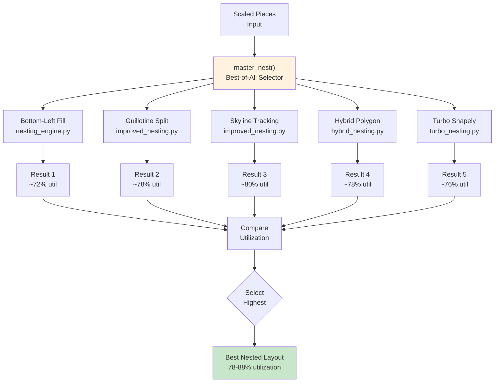

### Algorithm Characteristics

| Algorithm | Technique | Best For | Typical Utilization |
|-----------|-----------|----------|---------------------|
| Bottom-Left Fill | Shelf packing | Simple shapes | 70-75% |
| Guillotine | Rectangle splitting | Rectangular pieces | 75-80% |
| Skyline | Height tracking | Varied heights | 78-85% |
| Hybrid | Polygon collision | Complex shapes | 76-82% |
| Turbo | Shapely spatial index | Large batches | 74-80% |

### Nesting Constraints

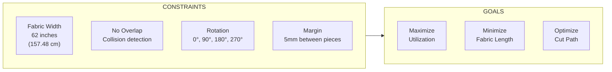

---

## 4. Cutter Queue Flow

Resilient queue with crash recovery via Write-Ahead Log (WAL).

### Queue Architecture

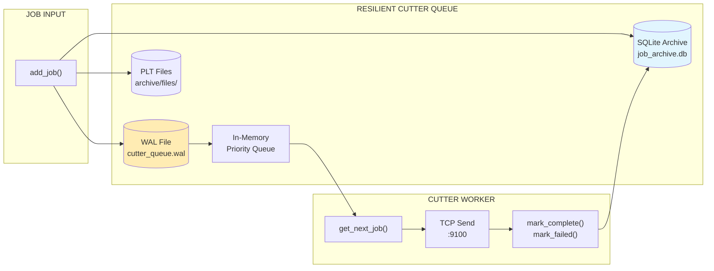

### Priority Ordering

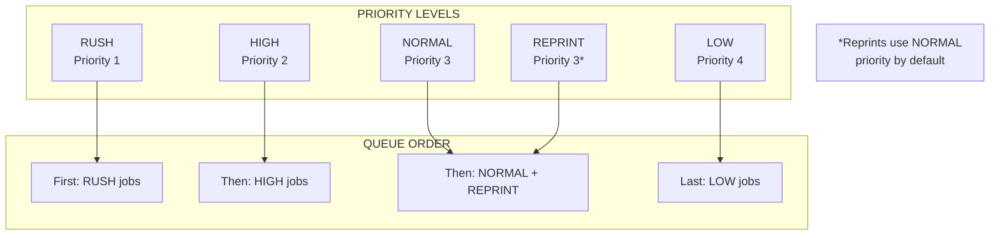

### Job Lifecycle

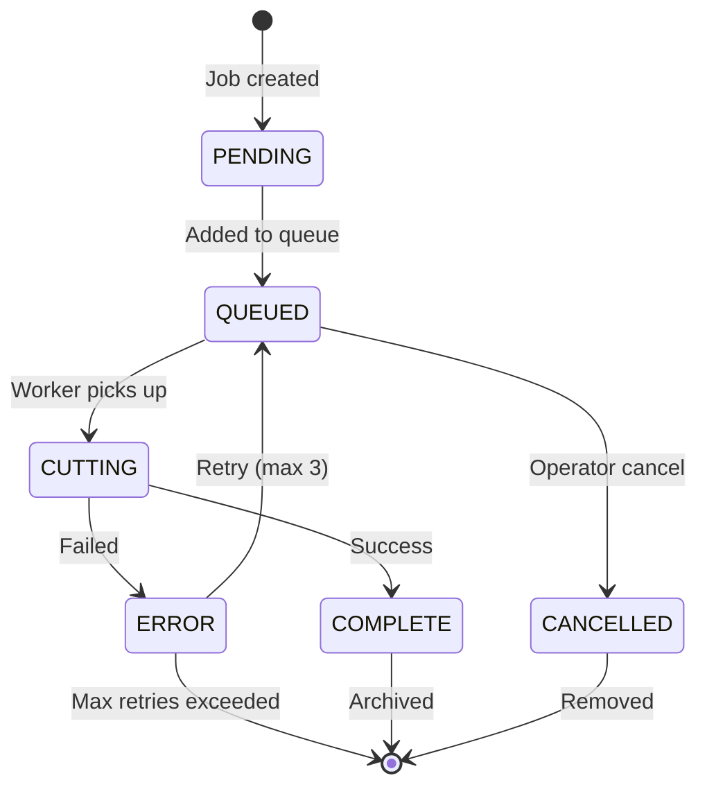

---

## 5. Recovery & Resilience

System recovers automatically from crashes using WAL replay.

### Crash Recovery Flow

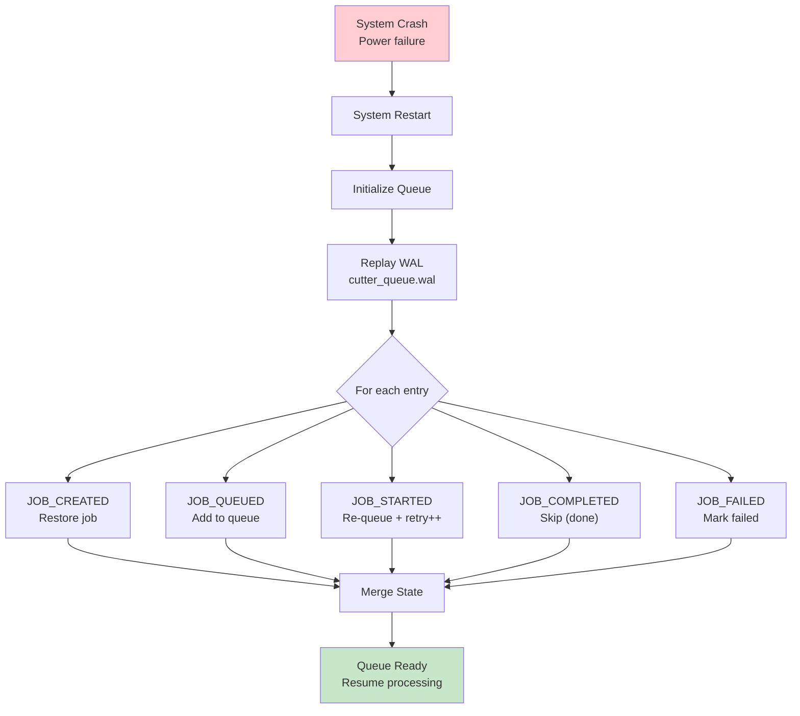

### Retry Logic

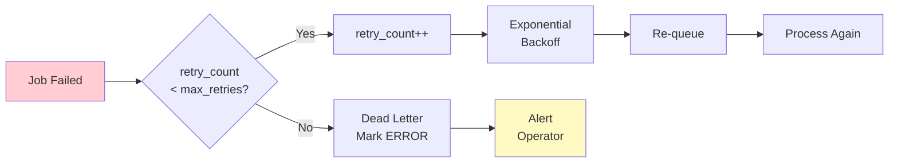

### Circuit Breaker Pattern

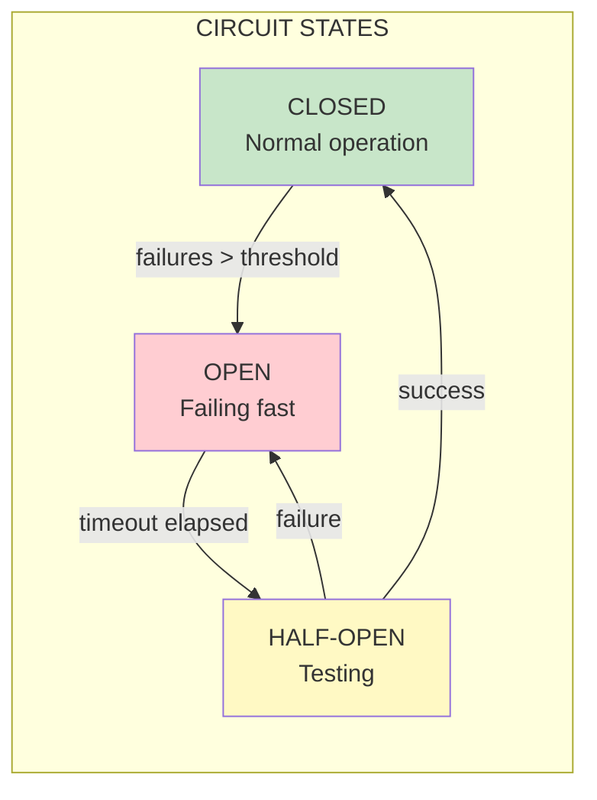

---

## 6. File Output Structure

Every order generates a complete set of files in a standardized folder structure.

### Folder Hierarchy

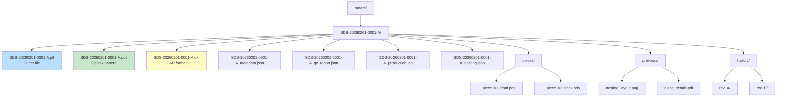

### File Types

| File | Format | Purpose | Required |
|------|--------|---------|----------|
| `.plt` | HPGL | Cutter instructions with labels | YES |
| `.pds` | Optitex PDS | Editable pattern file | YES |
| `.dxf` | AutoCAD DXF | CAD exchange format | YES |
| `_metadata.json` | JSON | Order parameters | YES |
| `_qc_report.json` | JSON | Quality validation | YES |
| `_production.log` | Text | Processing timeline | YES |
| `_nesting.json` | JSON | Nesting statistics | YES |

### Order ID Format

```
SDS-YYYYMMDD-NNNN-R

SDS        = SameDaySuits prefix (constant)
YYYYMMDD   = Order date (e.g., 20260201)
NNNN       = Sequential number (0001-9999)
R          = Revision letter (A, B, C...)

Example: SDS-20260201-0042-A
         SDS-20260201-0042-B (revision)
```

---

## 7. API Request Flow

Sequence diagram showing API interaction.

### Async Order Processing

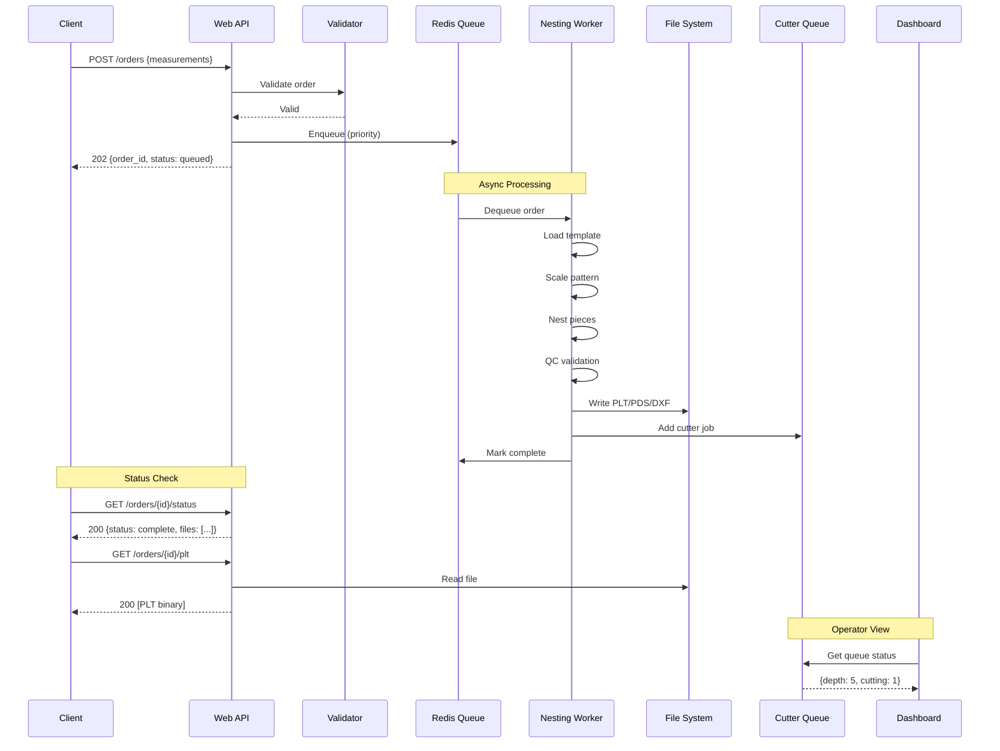

### API Endpoints Summary

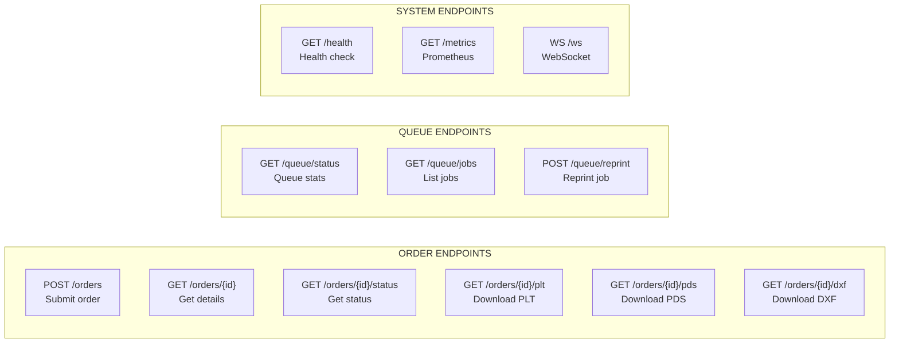

---

## 8. Deployment Architecture

Production deployment with Docker.

### Container Architecture

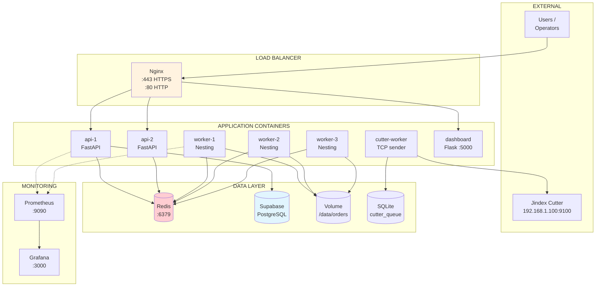

### Docker Compose Services

```yaml
# docker-compose.yml structure
services:
  nginx:        # Load balancer, SSL termination
  api:          # FastAPI (scale: 2)
  worker:       # Nesting workers (scale: 3)
  cutter:       # Cutter worker (scale: 1)
  dashboard:    # Operator UI
  redis:        # Queue backend
  prometheus:   # Metrics collection
  grafana:      # Dashboards
```

### Scaling Strategy

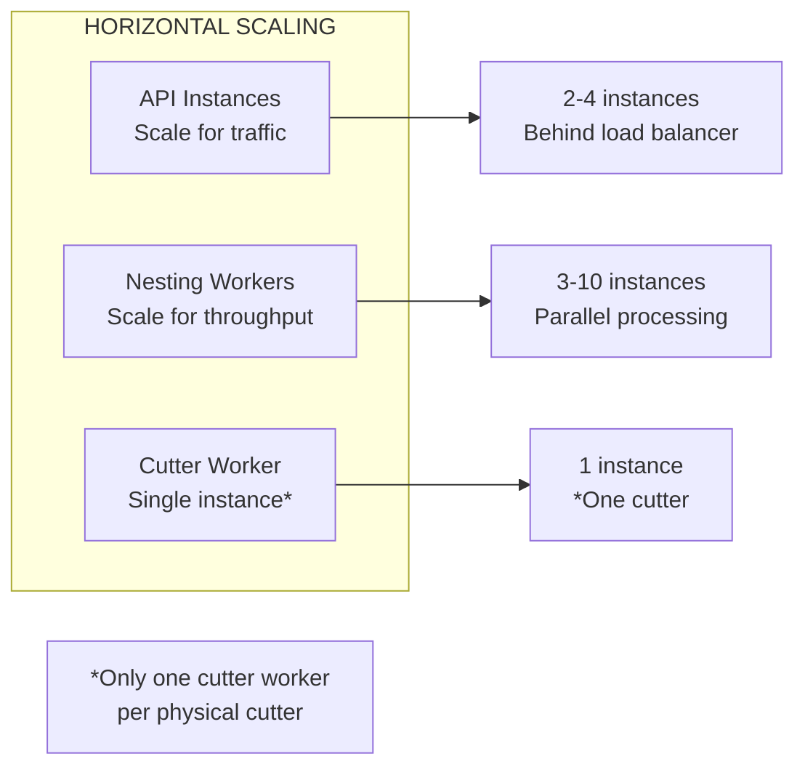

---

## 9. BlackBox Scanning Pipeline

Body scanning to pattern generation flow.

### Scan to Pattern Flow

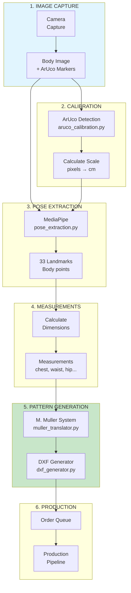

### BlackBox Components

| Component | File | Purpose |
|-----------|------|---------|
| ArUco Calibration | `aruco_calibration.py` | Scale detection from markers |
| Pose Extraction | `pose_extraction.py` | MediaPipe landmark detection |
| Muller Translator | `muller_translator.py` | M. Muller pattern system |
| DXF Generator | `dxf_generator.py` | Pattern file generation |
| BlackBox Bridge | `blackbox_bridge.py` | Integration with order queue |

---

## 10. Component Reference

### Directory Structure

```
production/
├── src/
│   ├── core/                    # Core pipeline modules
│   │   ├── samedaysuits_api.py  # Main API
│   │   ├── production_pipeline.py
│   │   ├── resilient_cutter_queue.py
│   │   ├── quality_control.py
│   │   └── ...
│   ├── nesting/                 # Nesting algorithms
│   │   ├── master_nesting.py    # Best-of-all selector
│   │   ├── improved_nesting.py  # Guillotine, skyline
│   │   ├── hybrid_nesting.py    # Polygon collision
│   │   └── turbo_nesting.py     # Shapely-based
│   ├── api/                     # Web API
│   │   └── web_api.py           # FastAPI endpoints
│   ├── workers/                 # Background workers
│   │   ├── nesting_worker.py    # Order processor
│   │   └── jindex_cutter.py     # Cutter interface
│   ├── blackbox/                # Body scanning
│   │   ├── pipeline.py
│   │   └── scanning/
│   ├── scalability/             # Queue & cache
│   ├── security/                # Auth & encryption
│   └── observability/           # Logging & metrics
├── scripts/                     # CLI tools
│   ├── cutter_cli.py
│   └── cutter_dashboard.py
├── tests/                       # Test suites
├── docs/                        # Documentation
├── samples/                     # Sample data
└── config/                      # Configuration
```

### Key Configuration

```bash
# Environment Variables
JWT_SECRET=your-secret-key
REDIS_URL=redis://localhost:6379/0
SUPABASE_URL=http://localhost:54321
SUPABASE_KEY=your-anon-key
JINDEX_IP=192.168.1.100
JINDEX_PORT=9100
CUTTER_DATA_DIR=./cutter_data
ASYNC_PROCESSING=false
```

### Port Reference

| Service | Port | Protocol |
|---------|------|----------|
| Web API | 8000 | HTTP |
| Dashboard | 5000 | HTTP |
| Redis | 6379 | TCP |
| Supabase | 54321 | HTTP |
| Jindex Cutter | 9100 | TCP |
| Prometheus | 9090 | HTTP |
| Grafana | 3000 | HTTP |
| Nginx HTTPS | 443 | HTTPS |

---

## Appendix: Quick Reference Diagrams

### A. Complete Data Flow (Simplified)

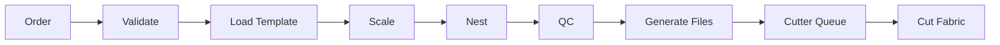

### B. Error Handling Flow

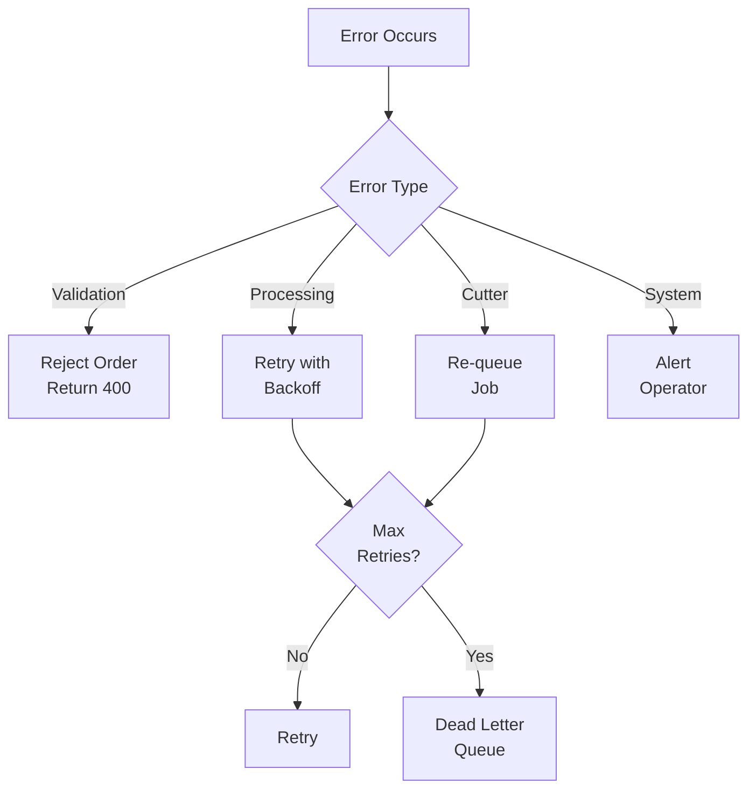

### C. Monitoring Flow

```mermaid
flowchart LR
    subgraph Apps["APPLICATIONS"]
        A1["API"]
        A2["Workers"]
        A3["Cutter"]
    end
    
    subgraph Metrics["METRICS"]
        PROM["Prometheus<br/>Scrape"]
        STORE[("Time Series<br/>Storage")]
    end
    
    subgraph Viz["VISUALIZATION"]
        GRAF["Grafana<br/>Dashboards"]
        ALERT["Alert<br/>Manager"]
    end
    
    A1 --> PROM
    A2 --> PROM
    A3 --> PROM
    PROM --> STORE
    STORE --> GRAF
    STORE --> ALERT
```

---

**Document End**

*Generated: 2026-02-01*  
*System Version: 6.4.3*  
*Architecture Version: 1.0*
